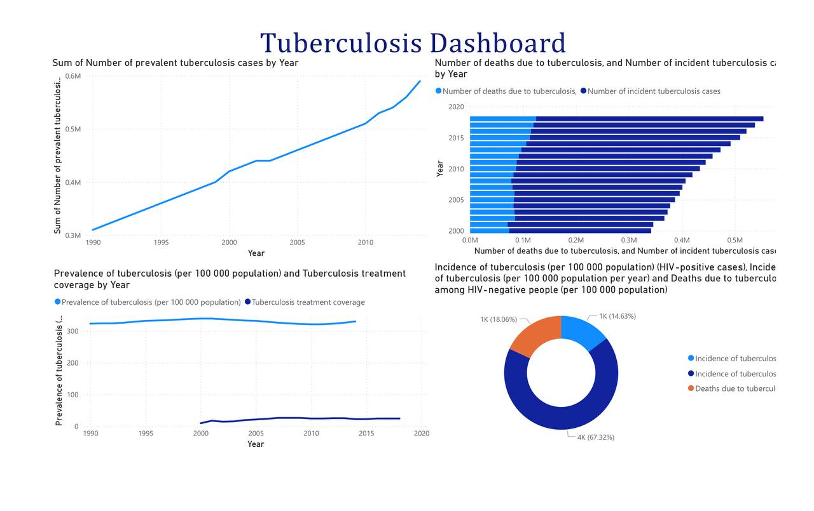

# Prevalence of Tuberculosis in Nigeria

## Overview
This project analyzes the trend and prevalence of tuberculosis (TB) in Nigeria using public health data from the World Health Organization (WHO). The aim is to uncover patterns in TB cases, treatment coverage, and demographic breakdowns to inform public health planning and awareness.

## Dataset
The dataset was sourced from the [World Health Organization (WHO) data portal](https://www.who.int/data) and includes:
- Mortality and disease indicators
- TB incidence, prevalence, and death rates
- HIV-related TB cases
- Treatment coverage and service availability
- Demographics by sex, income group, and location

Relevant tuberculosis data was extracted from a CSV file within a larger health dataset.

## Tools & Methodology
- **Python (JupyterLab):** Data cleaning, filtering, and exploratory analysis
- MySQL: For storing cleaned datasets
-front door of yFor visualizing trends and insights
- Libraries Used: pandas, numpy, seaborn, matplotlib, os

## Key Findings
-E.md is the front door of your project. from around 0.3 million to nearly 0.6 million between 2000 and 2020.
- TB incidence remains significantly higher in HIV-negative individuals, though HIV-positive cases are still notable.
- Treatment coverage has not kept pace with rising prevalence, indicating a gap in health service delivery.
- Visual insights show that while deaths are rising more slowly, the overall TB burden is growing.
  

## Folder Structure

Tuberculosis_prevalency/
│
├── tb_prevalency.ipynb                                      # Main analysis notebook
├── tb_dashboard.png                                         # Power BI dashboard image
├── Health Medical Presentation Tuberculosis.pptx            # Project summary slides
├── README.md                                                # Project overview and documentation
├── requirements.txt                                         # Project dependencies
└── .gitignore                                               # Files to exclude from Git tracking

## How to Use
1. Clone or download this repo
2. Install dependencies:
   ```bash
   pip install -r requirements.txt

 3. Open tb_prevalency.ipynb in JupyterLab or Jupyter Notebook
 4. Ensure dataset is in the expected folder if re-running the analysis

## License
This project is licensed under the MIT License. See the [LICENSE](LICENSE) file for details.

Author

Fehintolu SAmuel
